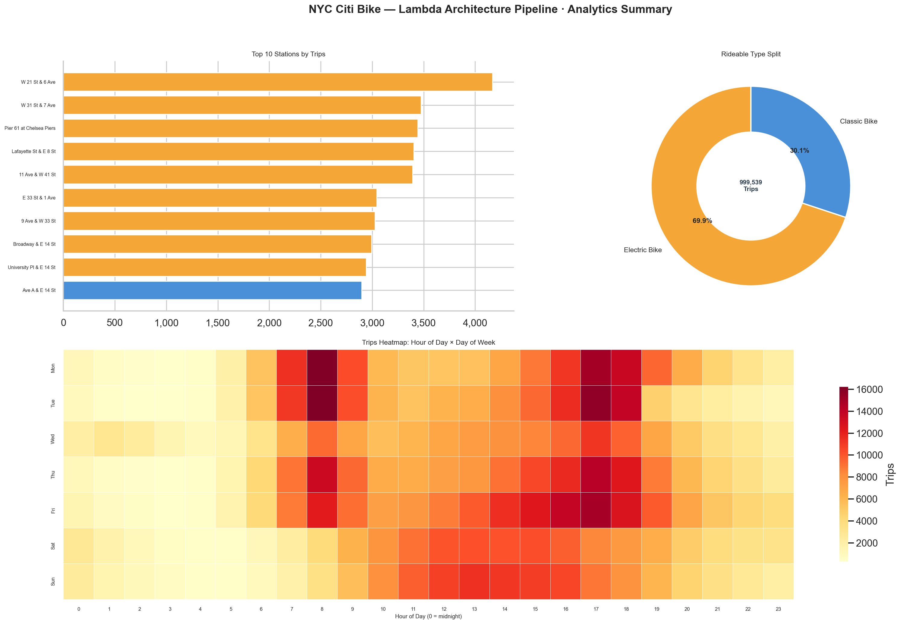
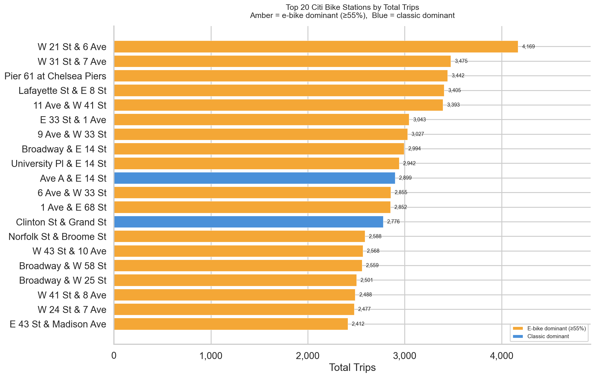
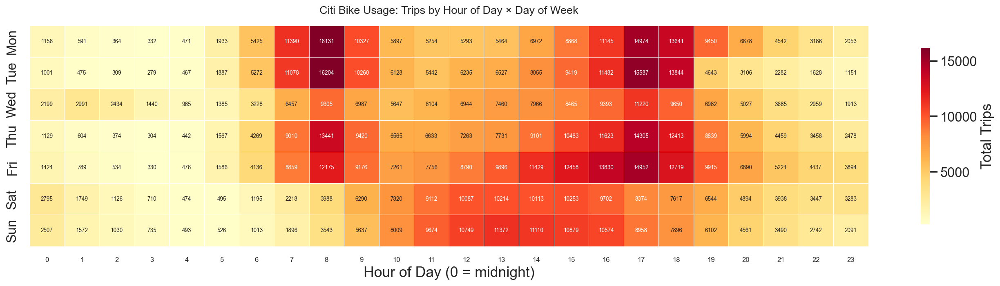
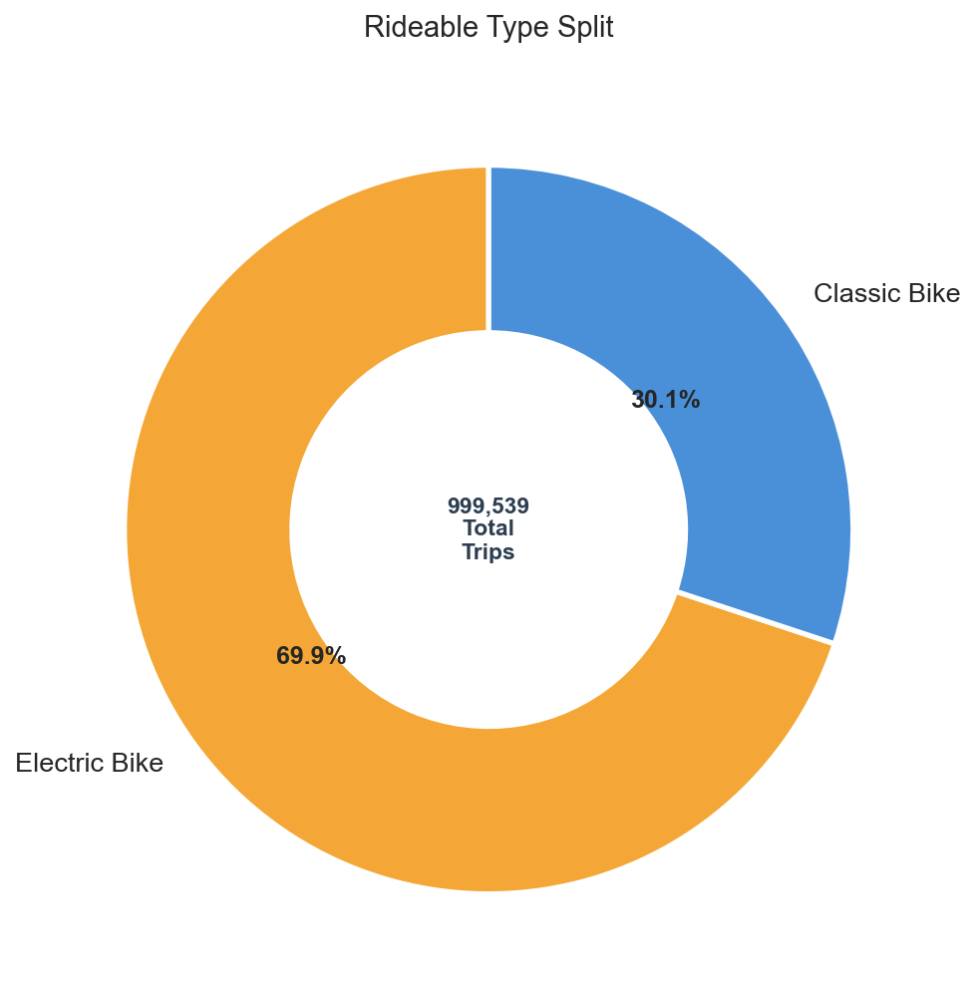
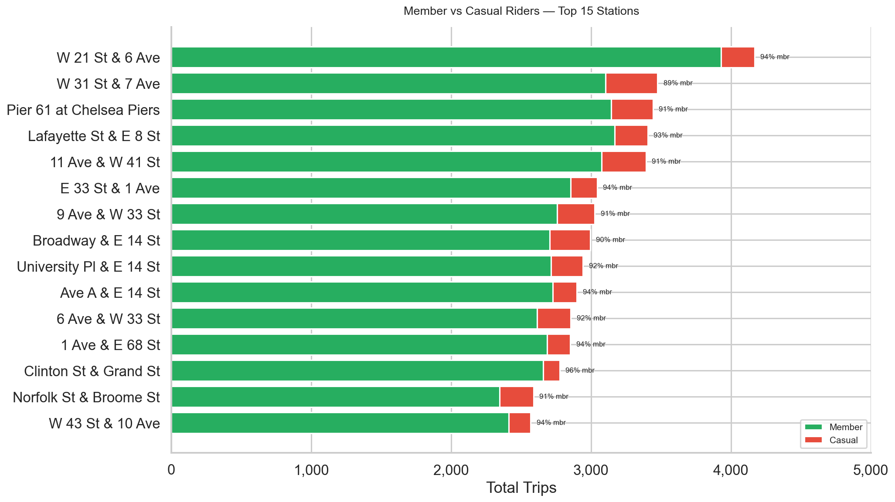
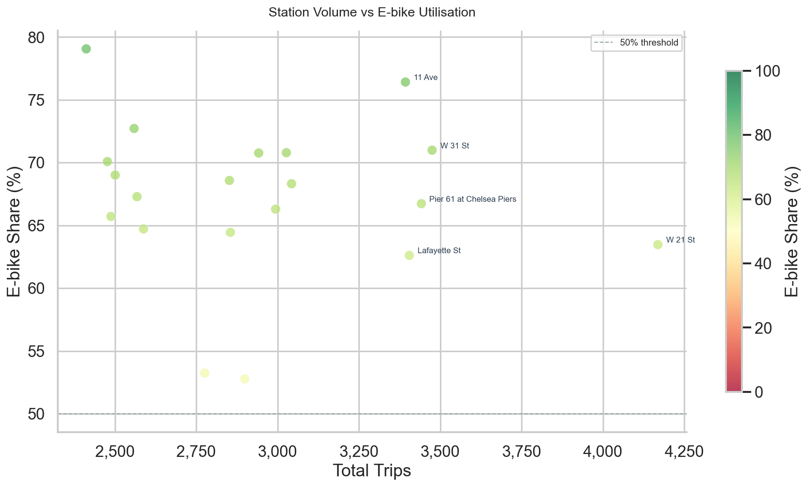
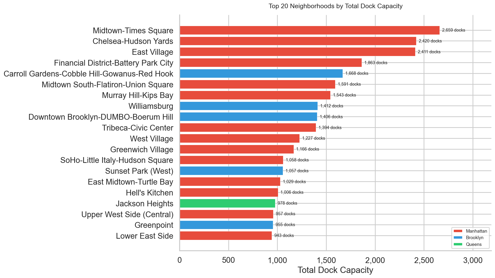

# NYC Citi Bike Equity Pipeline

A **Lambda Architecture** data pipeline for analysing Citi Bike station accessibility across NYC neighbourhoods — built with PySpark, Kafka, DuckDB, Airflow, and GeoPandas.

---

## Architecture

```
┌─────────────────────────────────────────────────────────────────────┐
│                        BATCH LAYER (monthly)                        │
│                                                                     │
│  Citi Bike public S3    PySpark / EMR         S3 Medallion          │
│  (raw CSV ZIPs)    ──►  bronze → silver  ──►  bronze/silver/gold    │
│                          transform.py                               │
└─────────────────┬───────────────────────────────────────────────────┘
                  │                         ▼
┌─────────────────┼───────────────────────────────────────────────────┐
│                 │     SERVING LAYER                                 │
│                 ├──►  DuckDB (analytics.py)  ──►  equity reports   │
│                 │     GeoParquet (spatial.py) ──►  neighbourhood    │
│                 │                                  scores           │
└─────────────────┼───────────────────────────────────────────────────┘
                  │
┌─────────────────▼───────────────────────────────────────────────────┐
│                     STREAMING LAYER (every 30 s)                    │
│                                                                     │
│  GBFS API          Kafka               Spark Structured Streaming   │
│  (lyft/bkn)  ──►  producer.py  ──►   consumer.py  ──►  S3          │
│                   topic:                                streaming/   │
│                   citibike-station-status                           │
└─────────────────────────────────────────────────────────────────────┘
```

### Technology stack

| Layer | Technology |
|---|---|
| Batch ingest | Python + `requests` + `boto3` |
| Batch transform | PySpark 3.5 (local or AWS EMR) |
| Real-time ingest | Kafka producer (`kafka-python`) |
| Real-time processing | Spark Structured Streaming |
| Spatial analysis | GeoPandas, Shapely |
| Serving / analytics | DuckDB, GeoParquet |
| Orchestration | Apache Airflow 2.8 |
| Infrastructure | Docker Compose (local), AWS S3 |
| CI | GitHub Actions |

---

## Project structure

```
nyc-citibike-equity-pipeline/
├── src/
│   ├── ingest.py           # Download monthly CSVs from Citi Bike public S3
│   ├── validate.py         # Schema & quality checks (both legacy and current schemas)
│   ├── transform.py        # PySpark: raw → bronze → silver → gold
│   ├── spatial.py          # GeoPandas: stations → NTA neighbourhoods, accessibility score
│   ├── analytics.py        # DuckDB queries: batch + streaming combined
│   ├── analytics_local.py  # DuckDB queries against local gold-layer Parquet
│   ├── visualize.py        # Matplotlib/Seaborn: 7 publication-quality charts
│   ├── dashboard.py        # Streamlit interactive dashboard
│   └── streaming/
│       ├── producer.py     # Kafka producer — polls GBFS every 30 seconds
│       └── consumer.py     # Spark Structured Streaming — Kafka → S3
├── dags/
│   ├── batch_pipeline_dag.py    # Monthly batch pipeline
│   └── streaming_monitor_dag.py # 15-min health checks
├── tests/
│   ├── test_ingest.py
│   ├── test_validate.py
│   └── test_streaming.py
├── config/
│   └── pipeline_config.yaml
├── outputs/
│   └── plots/              # Generated chart PNGs
├── run_pipeline.py         # Local pipeline entry point (analytics + charts)
├── .github/workflows/ci.yml
├── docker-compose.yml
├── Dockerfile
├── requirements.txt
└── .env.example
```

---

## Quick start

### Prerequisites

- Docker Desktop
- AWS account with an S3 bucket
- AWS credentials with S3 read/write access

### 1 — Configure environment

```bash
cp .env.example .env
# Edit .env and fill in your AWS credentials and S3 bucket name
```

### 2 — Start the full stack

```bash
docker compose up -d
```

This starts:
- **ZooKeeper** + **Kafka** broker
- **Producer** — polling `gbfs.lyft.com` every 30 seconds, publishing to `citibike-station-status`
- **Consumer** — Spark Structured Streaming, writing micro-batches to S3 every 5 minutes
- **Airflow** — available at http://localhost:8080 (admin / admin)

### 3 — Watch messages flowing

```bash
# Tail producer logs
docker compose logs -f producer

# Check how many messages are in the Kafka topic
docker compose exec kafka \
  kafka-console-consumer --bootstrap-server localhost:9092 \
  --topic citibike-station-status --from-beginning --max-messages 5
```

### 4 — Run the batch pipeline

Trigger the batch DAG manually in the Airflow UI for a specific month:

```
http://localhost:8080 → citibike_batch_pipeline → Trigger DAG w/ config:
{"yyyymm": "202301"}
```

Or run locally (requires PySpark):

```bash
python src/transform.py --yyyymm 202301 --stage all
```

### 5 — Run local analytics + charts

```bash
# Runs DuckDB queries → outputs/*.csv, then generates all charts → outputs/plots/
./citibike-env/bin/python run_pipeline.py --skip-sync
```

### 6 — Launch the interactive dashboard

```bash
./citibike-env/bin/python -m streamlit run src/dashboard.py
```

Opens at `http://localhost:8501` with 4 tabs: Overview, Stations, Temporal, and Equity.

---

## Data sources

| Source | Description | Update frequency |
|---|---|---|
| [Citi Bike System Data](https://citibikenyc.com/system-data) | Historical trip CSVs | Monthly |
| [GBFS station_status](https://gbfs.lyft.com/gbfs/2.3/bkn/en/station_status.json) | Live bike availability | Every 30 seconds |
| [GBFS station_information](https://gbfs.lyft.com/gbfs/2.3/bkn/en/station_information.json) | Station names, capacity, location | Daily |
| [NYC NTA boundaries](https://data.cityofnewyork.us/api/geospatial/cpf4-rkhq?method=export&type=GeoJSON) | Neighbourhood Tabulation Areas | Periodic |

---

## Medallion architecture (S3 layout)

```
s3://<bucket>/
├── raw/citibike/<YYYYMM>/          # original CSVs as uploaded
├── bronze/citibike/                # typed Parquet, schema-unified
│   └── year_month=202301/
├── silver/citibike/                # cleaned, deduplicated, enriched
│   └── year_month=202301/
├── gold/citibike/                  # aggregations
│   ├── trips_per_station/
│   ├── hourly_pattern/
│   ├── rideable_split/
│   └── neighborhood_scores.parquet # GeoParquet
└── streaming/citibike/
    └── station_status/             # Spark micro-batch output
        └── processing_date=2024-04-01/
```

---

## Equity analysis

The `spatial.py` module computes a **neighbourhood accessibility score**:

$$\text{score} = \frac{\text{station\_count}}{\text{area\_km}^2} \times \ln(1 + \text{avg\_daily\_trips})$$

Higher score → more bike-accessible neighbourhood.

The `analytics.py` **equity gap query** identifies stations that are:
- historically high-volume (from the batch gold layer), AND
- frequently empty (from the streaming real-time layer)

These are the stations most likely serving high-demand areas with not enough bikes-the core equity finding.

---

## Running tests

```bash
# install test dependencies
pip install -r requirements.txt

# run all tests
pytest tests/ -v

# run with coverage
pytest tests/ --cov=src --cov-report=term-missing
```

---

## CI/CD

GitHub Actions runs on every push to `main` or `develop`:

1. **Lint** — `ruff` style checks across `src/`, `dags/`, `tests/`
2. **Unit tests** — pytest with moto (mocked S3) and a live Kafka service container
3. **Docker build** — verifies the image builds and the producer import is clean

---

## Sample outputs

Run the local pipeline to regenerate all charts:

```bash
./citibike-env/bin/python run_pipeline.py --skip-sync
```

### Summary dashboard


### Top 20 stations by total trips


### Trip volume heatmap — hour of day × day of week


### Rideable type split


### Member vs casual riders — top 15 stations


### Station volume vs e-bike utilisation


### Top 20 neighbourhoods by dock capacity


---

## Planned enhancements (v2)

- [ ] AWS EMR step functions for distributed PySpark execution
- [ ] Kafka Schema Registry for Avro message serialisation
- [ ] dbt models on top of the gold layer for semantic layer
- [ ] Streamlit dashboard for real-time equity map
